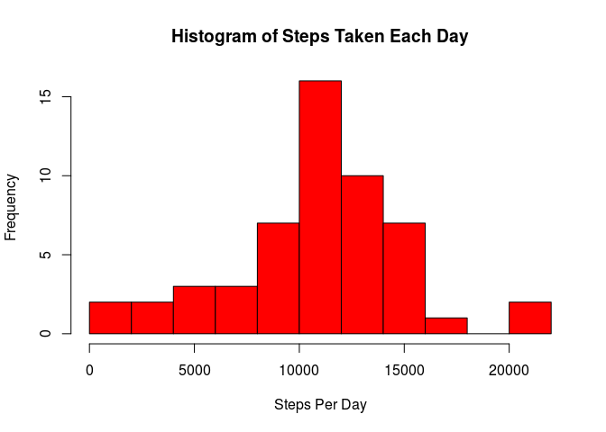
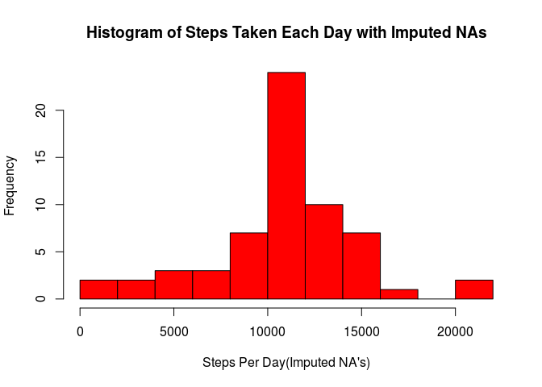
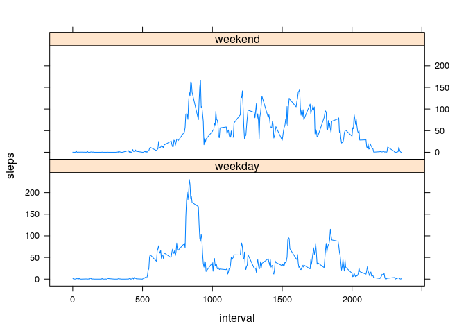

# Reproducible Research: Peer Assessment 1
William Scott Cochran  
10/17/2014  


## Loading and preprocessing the data

```r
setwd("~/Dropbox/Coursera/Data Science/Reproducible Research/RepData_PeerAssessment1")

# Unzip the data if its not already here
if(! file.exists('activity.csv')) {
        unzip('activity.zip')
}

df <- read.csv('activity.csv', 
               header = TRUE, 
               colClasses = c(steps="numeric",
                              date="Date",
                              interval="numeric"))
library(data.table)
Activity <- as.data.table(df)

stepsPerDay <- aggregate(steps ~ date, Activity, sum)
```

## What is mean total number of steps taken per day?

```r
hist(stepsPerDay$steps, 
     xlab = "Steps Per Day", 
     main ="Histogram of Steps Taken Each Day", 
     col = "red",
     breaks=10)
```

 

```r
meanStepsPerDay <- mean(stepsPerDay$steps)
medianStepsPerDay <- median(stepsPerDay$steps)
```

The mean steps taken per day is: 1.0766 &times; 10<sup>4</sup>

The median steps taken per day is: 1.0765 &times; 10<sup>4</sup>

## What is the average daily activity pattern?

```r
stepsPerInterval <- aggregate(steps ~ interval, Activity, mean)
plot(steps ~ interval, 
     data = stepsPerInterval, 
     type = 'l', 
     xlab="5 Minute Interval", 
     ylab="Mean Number of Steps",
     main="Average Daily Activity")
```

 

```r
maxAvgStepsInterval <- 
        stepsPerInterval[which.max(stepsPerInterval$steps),]$interval
maxAvgSteps <- stepsPerInterval[which.max(stepsPerInterval$steps),]$steps
```
Interval number 835 has the maximum average number(206.1698) of steps.


## Imputing missing values

```r
missingData <- sum(!complete.cases(Activity))

ActivityImputed <- Activity[,steps := ifelse(is.na(steps), 
                                          mean(steps, na.rm=TRUE),
                                          steps),
                         by=interval]

stepsPerDayImputed <- aggregate(steps ~ date, ActivityImputed, sum)

hist(stepsPerDayImputed$steps, 
     xlab = "Steps Per Day(Imputed NA's)", 
     main ="Histogram of Steps Taken Each Day with Imputed NAs", 
     col = "red",
     breaks=10)
```

 

```r
meanStepsPerDayImputed <- mean(stepsPerDayImputed$steps)
medianStepsPerDayImputed <- median(stepsPerDayImputed$steps)
```
There were 2304 missing values which were imputed as the mean for their given interval.

The process of imputing mean values for the missing step data coerced the step counts to floats, causing the value of the median steps to be rounded up 1 step.

The Imputed NA mean steps taken per day is: 1.0766 &times; 10<sup>4</sup>

The Imputed NA median steps taken per day is: 1.0766 &times; 10<sup>4</sup>


## Are there differences in activity patterns between weekdays and weekends?

```r
ActivityImputed[, daytype:= ifelse(weekdays(date)=="Saturday" 
                                   | weekdays(date)=="Sunday",
                                   "weekend", "weekday")]
```

```
##          steps       date interval daytype
##     1: 1.71698 2012-10-01        0 weekday
##     2: 0.33962 2012-10-01        5 weekday
##     3: 0.13208 2012-10-01       10 weekday
##     4: 0.15094 2012-10-01       15 weekday
##     5: 0.07547 2012-10-01       20 weekday
##    ---                                    
## 17564: 4.69811 2012-11-30     2335 weekday
## 17565: 3.30189 2012-11-30     2340 weekday
## 17566: 0.64151 2012-11-30     2345 weekday
## 17567: 0.22642 2012-11-30     2350 weekday
## 17568: 1.07547 2012-11-30     2355 weekday
```

```r
ActivityImputed[, daytype := as.factor(daytype)]
```

```
##          steps       date interval daytype
##     1: 1.71698 2012-10-01        0 weekday
##     2: 0.33962 2012-10-01        5 weekday
##     3: 0.13208 2012-10-01       10 weekday
##     4: 0.15094 2012-10-01       15 weekday
##     5: 0.07547 2012-10-01       20 weekday
##    ---                                    
## 17564: 4.69811 2012-11-30     2335 weekday
## 17565: 3.30189 2012-11-30     2340 weekday
## 17566: 0.64151 2012-11-30     2345 weekday
## 17567: 0.22642 2012-11-30     2350 weekday
## 17568: 1.07547 2012-11-30     2355 weekday
```

```r
stepsPerIntervalImputed <- 
        aggregate(steps ~ interval + daytype, ActivityImputed, mean)

library(lattice)
xyplot(steps ~ interval | daytype,
       stepsPerIntervalImputed,
       type='l',
       layout = c(1, 2))
```

 
